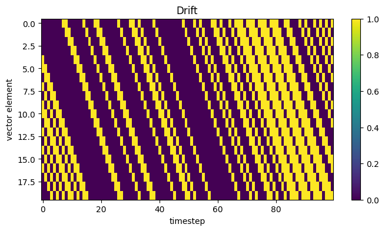
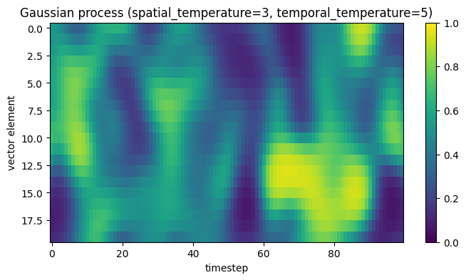
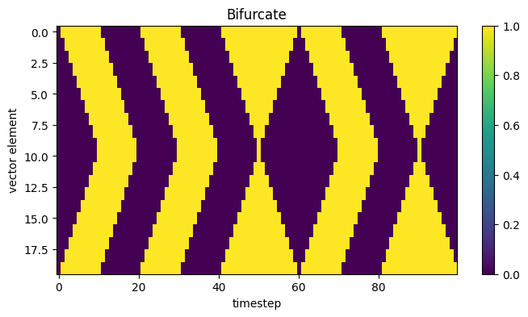
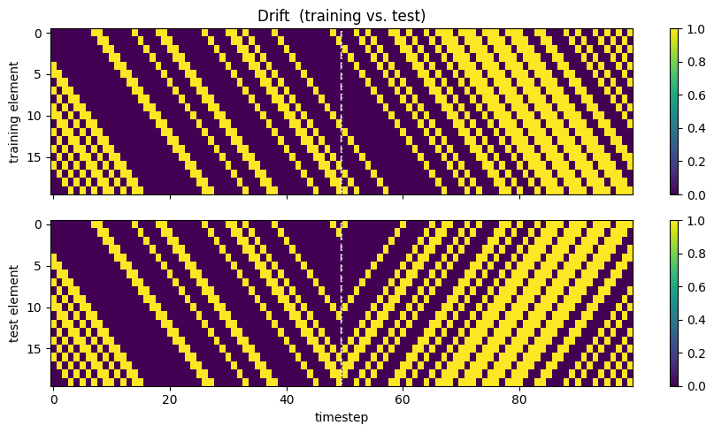
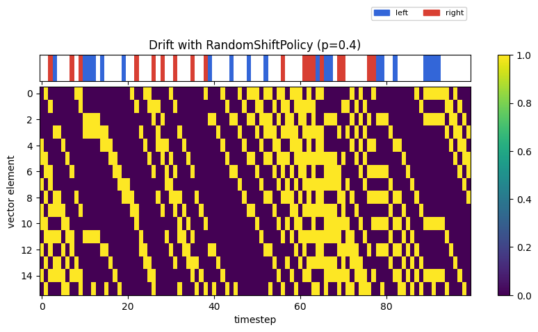
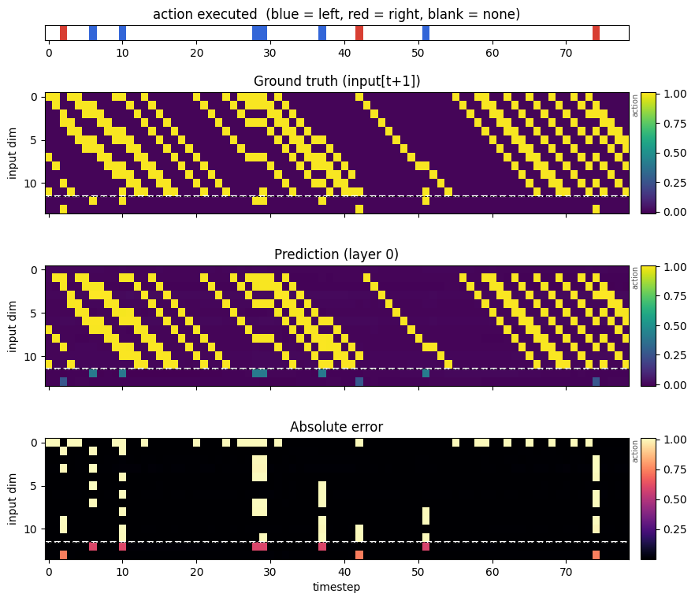
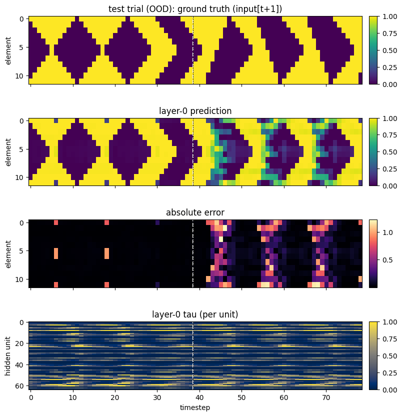

# toy_v1 — action-conditioned stacked predictive-coding RNN

This directory builds a small **self-supervised, next-step prediction** system: a
family of timeseries tasks (each with an out-of-distribution **test** variant), an
**action interface** with a simple policy, and a **stack of recurrent
predictive-coding layers** (PyTorch) — including a version whose timeconstant
`tau` is **learned per unit** — that predicts the next observation, optionally
conditioned on the action the agent is about to take.

It is the second in a series (`toy_v0` → `toy_v1` → `toy_v2`). `toy_v0`
introduced the tasks and a next-step RNN; `toy_v1` adds **actions/policies**, a
**learned timeconstant**, and **test conditions**; `toy_v2` later replaces the
gradient-based model with a gradient-free Hebbian one.

---

## Directory layout

```
tasks/
  base.py               # abstract Task; action-aware step(action); test mode
  binary_noise.py       # BinaryNoiseTask   (i.i.d. / sticky Bernoulli noise)
  drift.py              # DriftTask         (vector drifts right each step)
  gaussian_process.py   # GaussianProcessTask (analog field, correlated in space & time)
  bifurcate.py          # BifurcateTask     (ones breathe in from the edges, then split)
  actions.py            # left / right / none, one-hot encoding, feedback alignment
  policies.py           # Policy base class + RandomShiftPolicy
  rollout.py            # roll a policy over a task -> (observations, actions)
  demo_tasks.ipynb      # visualizes all four tasks
  demo_actions.ipynb    # visualizes actions + policy effects on the tasks
  demo_task_tests.ipynb # training vs. out-of-distribution test conditions
models/
  rnn_predictor.py             # PredictiveRNNLayer + StackedRNNPredictor (fixed tau)
  rnn_predictor_learned_tau.py # LearnedTau* : learned per-unit, per-step tau
  demo_actions.ipynb           # train the learned-tau model on policy rollouts
  demo_no_actions.ipynb        # train with no actions, evaluate on OOD test conditions
  README.md                    # model details + the "slow latent, fast prediction" puzzle
images/                        # figures used in this README (exported from the demos)
```

---

## Tasks

Each task is a timeseries of vectors sharing the same `Task` interface
(`reset` / `step` / `generate`).

- **Binary noise** — Bernoulli(`prob`) per element; `resample_prob` controls how
  "sticky" the noise is (fully i.i.d. at 1.0, slowly changing below that).
- **Drift** — a binary vector that shifts one position right each step, a fresh
  Bernoulli sample entering on the left (a clean motion signal):

  

- **Gaussian process** — an analog field in `[0, 1]` correlated over both space
  and time (temperatures set the correlation lengthscales):

  

- **Bifurcate** — ones encroach inward from both edges until they meet (all ones);
  then zeros return either from the **middle** (ones retreat to the ends) or from
  the **ends** (ones shrink in the middle), each with probability 0.5, until all
  zeros — then the cycle restarts. Which way the zeros return is the one genuinely
  unpredictable event:

  

### Out-of-distribution test conditions

Every task has a **test** variant, `generate(..., test=True)`, in which the
dynamics change partway through the trial (at the midpoint), for probing whether a
trained model has really learned the structure or just memorized the training
regime:

- **drift** — the drift direction reverses (right → left)
- **binary noise** — the Bernoulli probability jumps to `test_prob`
- **gaussian process** — the spatial and temporal frequencies double
- **bifurcate** — after the ones meet, the zeros return **double-fast from a single
  end** instead of symmetrically

Because the pre-switch dynamics are unchanged, a training and a test trial from the
same seed are identical up to the switch (dashed line) and only diverge after it:



### Actions and policies

Every task can be driven by an **action** each step: `left` / `right` shift the
vector one cell (cutting off one end, filling the other with a fresh
task-appropriate sample), and a do-nothing action leaves it unchanged. Actions are
one-hot encoded over `{left, right}` (do-nothing = all zeros).

A **policy** chooses actions. `RandomShiftPolicy(action_probability=p)` takes a
random shift with probability `p`, otherwise does nothing; the `Policy` base class
makes it easy to add smarter policies later. `rollout(task, policy, T)` drives a
policy over a task and returns aligned observation/action sequences.

Because drift carries its state forward, a `left` action can cancel the intrinsic
rightward drift while `right` compounds it — visible where the diagonal bands bend
(blue = left, red = right):



---

## The model

`StackedRNNPredictor` (and its learned-tau sibling `LearnedTauStackedRNNPredictor`)
is a stack of predictive layers:

- **Layer 0** next-step predicts the stimulus.
- **Each higher layer** auto-encodes the layer below it — it runs the identical
  recurrent dynamics over the (detached) latent trajectory of the layer beneath it
  and next-step predicts it.

Each layer's recurrent cell has a timeconstant `tau` (with the `1 - tau`
convention, so **small `tau` = slow, persistent dynamics**), training-only latent
noise, and can be **conditioned on the action** taken at that timestep:

```
h(t+1) = (1 − tau) · h(t) + tau · tanh(encoder(h(t) + noise, input(t), action(t)))
pred(t) = decoder_scale · tanh(decoder(h(t+1), input(t)))     # predicts input(t+1)
```

Other design points: a bottom-up **MLP state initialization** (from the first two
stimulus steps and the below layer's initial state); a decoder that reads out from
the current latent *and the previous input* (a skip connection); optional **action
feedback** (the executed action's one-hot appended to the next input); and
**separate gradients per layer** (the latent trajectory handed upward is detached,
so each layer trains purely on its own L1 next-step loss).

The [`LearnedTauStackedRNNPredictor`](models/rnn_predictor_learned_tau.py) instead
computes a **per-unit `tau` at every timestep** (`sigmoid` of a small head), with
an L1 regularizer on the mean tau so it prefers slow dynamics unless faster
updating helps. See [`models/README.md`](models/README.md) for a schematic and an
explanation of how a layer's prediction can stay fast while its latent freezes.

### What it learns

Trained on policy-driven rollouts, layer 0 predicts the (action-shifted) next
stimulus. Below: the action strip (top), ground-truth next input, the prediction,
and the error — the bottom rows are the appended action-feedback dimensions, which
light up in step with the action strip:



### Evaluating on test conditions

`models/demo_no_actions.ipynb` trains the model on normal (in-distribution) trials
and then evaluates it on an **out-of-distribution test** trial. The failure is
clear: the drift model predicts the rightward motion perfectly until the midpoint,
but when the direction reverses (something it never saw in training) it keeps
predicting the old direction and the error explodes after the switch line
(first-half L1 ≈ 0.03, second-half L1 ≈ 0.48):



---

## Running it

From inside `toy_v1/`:

```bash
jupyter notebook tasks/demo_tasks.ipynb        # the four tasks
jupyter notebook tasks/demo_actions.ipynb      # actions + policy effects
jupyter notebook tasks/demo_task_tests.ipynb   # training vs. test conditions
jupyter notebook models/demo_actions.ipynb     # train the learned-tau model (with actions)
jupyter notebook models/demo_no_actions.ipynb  # train w/o actions, evaluate OOD
```

Minimal programmatic use:

```python
import numpy as np, torch
from tasks import DriftTask, BifurcateTask
from models import LearnedTauStackedRNNPredictor

stim = np.stack([DriftTask(12, prob=0.3).generate(80, seed=i) for i in range(64)])
x = torch.tensor(stim, dtype=torch.float32)

model = LearnedTauStackedRNNPredictor(input_dim=12, hidden_dims=[64, 64, 64],
                                      action_dim=0, tau_reg_coeff=0.05)
res = model.compute_losses(x)   # {'l1', 'tau_reg', 'total', 'taus', ...}
res['total'].backward()

# out-of-distribution test stimulus (drift direction reverses at the midpoint):
test = DriftTask(12, prob=0.3).generate(80, seed=0, test=True)
```

The demo notebooks expose the task choice (including `'bifurcate'`), stack depth
(`HIDDEN_DIMS`), the tau regularizer (`TAU_REG_COEFF`), and — for the actions demo
— the policy `action_probability` and an action-feedback flag near the top.

---

## Ideas for future directions

- **Learned / smarter policies.** `RandomShiftPolicy` is a placeholder. Add
  policies that actively reduce prediction error (or seek it) — the "exploration
  policies" theme — and study how action choice shapes what the model learns.
- **Use the prediction error as a signal.** Feed each layer's prediction error
  back into the dynamics (true predictive coding), or use it to drive attention or
  action selection.
- **Adapt to the test conditions.** The model currently fails OOD; explore online
  adaptation, or policies that detect and probe the change (e.g. act to disambiguate
  which way the bifurcation went).
- **Longer-horizon / rollout prediction.** Predict several steps ahead, or let the
  model imagine action-conditioned rollouts and measure multi-step accuracy.
- **Study the learned tau.** How does the tau regularizer weight, per layer, trade
  off prediction accuracy against slow dynamics? When does a layer choose fast vs.
  slow units?
- **Bridge to `toy_v2`.** Compare this gradient-based predictive coder with the
  gradient-free Hebbian model in `toy_v2` on the same drifting stimulus.
