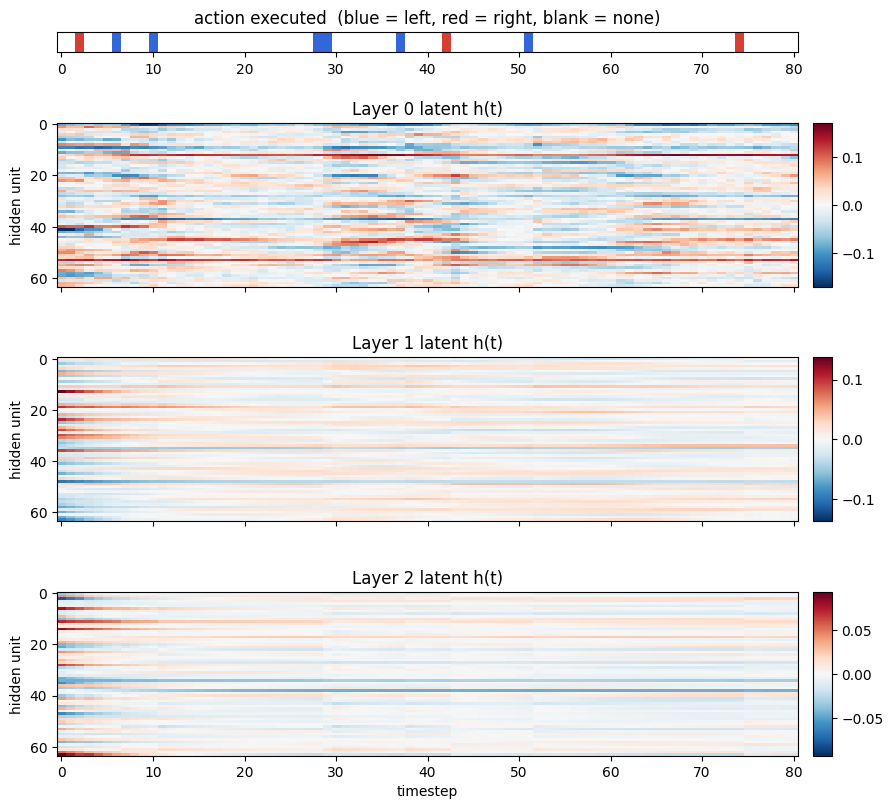

# toy_v1 — action-conditioned stacked predictive-coding RNN

This directory builds a small **self-supervised, next-step prediction** system: a
family of timeseries tasks, an **action interface** with a simple policy, and a
**stack of recurrent predictive-coding layers** (PyTorch) that learns to predict
the next observation — conditioned on the action the agent is about to take.

It is the second in a series (`toy_v0` → `toy_v1` → `toy_v2`). `toy_v0`
introduced the tasks and a next-step RNN; `toy_v1` adds **actions/policies** and
makes the model **action-conditioned**; `toy_v2` later replaces the gradient-based
model with a gradient-free Hebbian one.

---

## Directory layout

```
tasks/
  base.py               # abstract Task; action-aware step(action)
  binary_noise.py       # BinaryNoiseTask   (i.i.d. / sticky Bernoulli noise)
  drift.py              # DriftTask         (vector drifts right each step)
  gaussian_process.py   # GaussianProcessTask (analog field, correlated in space & time)
  actions.py            # left / right / none, one-hot encoding, feedback alignment
  policies.py           # Policy base class + RandomShiftPolicy
  rollout.py            # roll a policy over a task -> (observations, actions)
  demo_tasks.ipynb      # visualizes the three tasks
  demo_actions.ipynb    # visualizes actions + policy effects on the tasks
models/
  rnn_predictor.py      # PredictiveRNNLayer + StackedRNNPredictor
  train_rnn_predictor.ipynb   # train + visualize predictions, latents, actions
images/                 # figures used in this README (exported from the demos)
```

---

## Tasks

Each task is a timeseries of vectors. All share the same `Task` interface
(`reset` / `step` / `generate`).

- **Binary noise** — Bernoulli(`prob`) per element; a `resample_prob` controls
  how "sticky" the noise is (fully i.i.d. at 1.0, slowly changing below that).
- **Drift** — a binary vector that shifts one position right each step, with a
  fresh Bernoulli sample entering on the left (a clean, predictable motion signal):

  

- **Gaussian process** — an analog field in `[0, 1]` correlated over both space
  and time (temperatures set the correlation lengthscales):

  

### Actions and policies

Every task can be driven by an **action** each step: `left` / `right` shift the
vector one cell (cutting off one end, filling the other with a fresh
task-appropriate sample), and a do-nothing action leaves it unchanged. Actions
are one-hot encoded over `{left, right}` (do-nothing = all zeros).

A **policy** chooses actions. `RandomShiftPolicy(action_probability=p)` takes a
random shift with probability `p` and otherwise does nothing; the `Policy` base
class makes it easy to add smarter policies later. `rollout(task, policy, T)`
drives a policy over a task and returns aligned observation/action sequences.

Because drift carries its state forward, a `left` action can cancel the intrinsic
rightward drift while `right` compounds it — visible where the diagonal bands
bend (blue = left, red = right):


---

## The model

`StackedRNNPredictor` is a stack of any number of `PredictiveRNNLayer`s.

- **Layer 0** next-step predicts the stimulus.
- **Each higher layer** auto-encodes the layer below it *the same way* — it runs
  the identical recurrent dynamics over the (detached) latent trajectory of the
  layer beneath it and next-step predicts it.

Each layer's recurrent cell has a timeconstant `tau`, training-only latent noise,
and is **conditioned on the action** taken at that timestep:

```
h(t+1) = tau · h(t) + tanh((1 − tau) · encoder(h(t) + noise, input(t), action(t)))
```

Since the action at step `t` modifies the *next* observation, feeding it to the
encoder makes the prediction action-conditioned. Other design points:

- **State initialization** is a bottom-up cascade of MLPs: each layer's initial
  state is `tanh` of an MLP over the first two stimulus steps and the (detached)
  initial state of the layer below.
- **Decoder** reads out the next-step prediction through a scaled `tanh`,
  conditioned on the current latent *and the previous input*.
- **Optional action feedback**: the one-hot of the executed action can be
  appended to the following input, so those extra input dimensions carry the
  action code.
- **Separate gradients per layer**: the latent trajectory handed upward is
  detached, so every layer is trained purely by its own L1 next-step loss and no
  gradient crosses between layers.

### What it learns

Trained on policy-driven rollouts, layer 0 predicts the (action-shifted) next
stimulus. Below, the action strip (top), ground-truth next input, the model's
prediction, and the error — note the bottom rows are the appended action-feedback
dimensions, which light up in step with the action strip:


The stacked latents form increasingly smooth, slow representations up the
hierarchy:



---

## Running it

From inside `toy_v1/`:

```bash
jupyter notebook tasks/demo_tasks.ipynb            # the three tasks
jupyter notebook tasks/demo_actions.ipynb          # actions + policy effects
jupyter notebook models/train_rnn_predictor.ipynb  # train + visualize
```

Minimal programmatic use:

```python
import numpy as np, torch
from tasks import DriftTask, RandomShiftPolicy, rollout
from tasks.actions import ACTION_DIM, one_hot
from models import StackedRNNPredictor

obs, acts = rollout(DriftTask(12, prob=0.3), RandomShiftPolicy(0.4), num_steps=80, seed=0)
x = torch.tensor(obs, dtype=torch.float32)[None]
a = torch.tensor(one_hot(acts), dtype=torch.float32)[None]

model = StackedRNNPredictor(input_dim=12, hidden_dims=[64, 64, 64], action_dim=ACTION_DIM)
loss = model.compute_loss(x, a)   # sum of per-layer L1 next-step losses
loss.backward()
```

The training notebook exposes the task choice, stack depth (`HIDDEN_DIMS`),
policy `action_probability`, and an action-feedback flag near the top.

---

## Ideas for future directions

- **Learned / smarter policies.** `RandomShiftPolicy` is a placeholder. Add
  policies that actively reduce prediction error (or seek it) — the
  "exploration policies" theme — and study how action choice shapes what the
  predictive model learns.
- **Use the prediction error as a signal.** Feed each layer's prediction error
  back into the dynamics (true predictive coding), or use it to drive attention
  or action selection.
- **Longer-horizon / rollout prediction.** Predict several steps ahead, or let
  the model imagine action-conditioned rollouts and evaluate multi-step accuracy.
- **Probe representations across tasks.** Train on one task family and test
  transfer; measure how much of the stimulus the latents actually encode
  (linear decodability, mutual information).
- **Architecture sweeps.** Vary depth, `tau` per layer, noise schedule,
  initializer capacity, and the with/without action-feedback conditions; see what
  helps hierarchical prediction.
- **Bridge to `toy_v2`.** Compare this gradient-based predictive coder with the
  gradient-free Hebbian model in `toy_v2` on the same drifting stimulus — what do
  the two learning regimes have in common, and where do they diverge?
