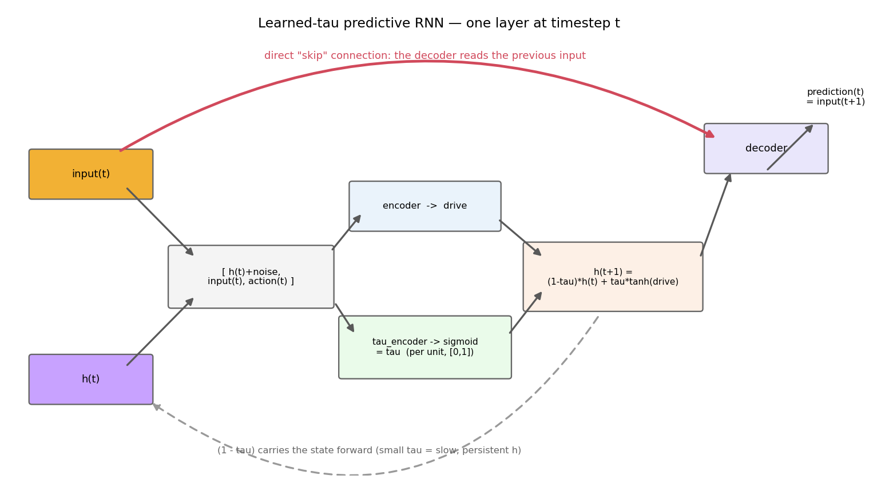
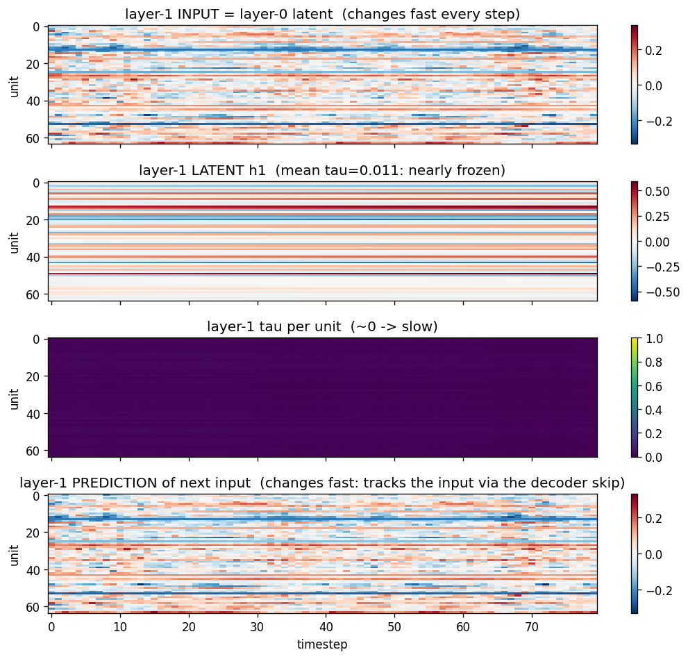

# models — stacked predictive-coding RNNs

Two next-step-prediction models, each a stack of recurrent layers where **layer 0
predicts the stimulus and every higher layer predicts (auto-encodes) the latent
trajectory of the layer below it**. Higher layers consume the *detached* latents
of the layer beneath them, so the layers train on **entirely separate gradients**
(each by its own L1 next-step loss).

- [`rnn_predictor.py`](rnn_predictor.py) — `StackedRNNPredictor`: a **fixed**
  scalar timeconstant `tau` per layer.
- [`rnn_predictor_learned_tau.py`](rnn_predictor_learned_tau.py) —
  `LearnedTauStackedRNNPredictor`: a **learned, per-unit, per-timestep** `tau`,
  plus an L1 regularizer on the mean tau (this is the model used by the demos).

Both use the `(1 - tau)` convention, so **`tau → 0` means slow, persistent
dynamics** (`h` barely changes) and `tau → 1` means fast updating.

Notebooks: [`demo_actions.ipynb`](demo_actions.ipynb) trains the learned-tau model
on policy rollouts (with actions); [`demo_no_actions.ipynb`](demo_no_actions.ipynb)
trains it with no actions and evaluates on out-of-distribution test conditions.

---

## The learned-tau model

Each layer, at each timestep, computes a per-unit timeconstant from the same
inputs the encoder sees, and uses it to mix the previous state with a fresh drive:

```
tau(t)   = sigmoid(tau_encoder( h(t) + noise, input(t), action(t) ))    # per unit, in [0, 1]
h(t+1)   = (1 - tau(t)) * h(t) + tau(t) * tanh( encoder( h(t) + noise, input(t), action(t) ) )
pred(t)  = decoder_scale * tanh( decoder( h(t+1), input(t) ) )          # predicts input(t+1)
```

An L1 term `tau_reg_coeff * mean(tau)` (a scalar, or one coefficient per layer) is
added to the loss, so the model **prefers slow dynamics unless faster updating
actually helps prediction**.



The one detail to notice — highlighted in red above — is that the **decoder reads
the previous `input(t)` directly**, alongside the current latent `h(t+1)`. That
"skip" connection is the key to the puzzle below.

---

## How can a layer's prediction be fast while its latent is (almost) frozen?

When you train the learned-tau model (e.g. on drift), the higher layers drive
their tau close to **0** — their latent `h` becomes nearly **static**, holding an
almost constant value across the whole trial. Yet those same layers still produce
**next-step predictions that change every timestep**. How?

Look at the readout: `pred(t) = decoder( h(t+1), input(t) )`. It depends on two
things:

1. **`h(t+1)`** — the recurrent latent. With `tau ≈ 0` this is frozen, so it
   contributes only a slow, near-constant *context*.
2. **`input(t)`** — the layer's previous input, fed to the decoder **directly**
   through the skip connection. For a higher layer this input is the *layer below's
   latent*, which changes quickly every step.

So the prediction inherits its fast, moment-to-moment variation from `input(t)`,
not from the frozen latent. The decoder essentially learns a fast, mostly
**feed-forward** map "given the current input, what's the next input?", while the
slow latent supplies a stable summary/context on the side.

Why does the model *choose* this? The tau regularizer pushes tau toward 0 (slow)
unless fast state updates reduce prediction error. But the skip connection already
lets the decoder predict the next input well from the current input directly, so
the recurrent state doesn't *need* to churn — and the regularizer freezes it. The
skip connection and the regularizer together produce **slow latents with fast
predictions**.

The figure below (layer 1 of a 2-layer model trained on drift, learned mean
`tau ≈ 0.01`) shows exactly this. The latent (row 2) is frozen horizontal
stripes, yet the prediction (row 4) is as lively as the input (row 1):



Measured on this trial: the layer-1 **latent** changes by only ~0.0006 per step,
while its **input** changes by ~0.04 per step (about 70× faster) — and the
prediction tracks the input, not the latent.
