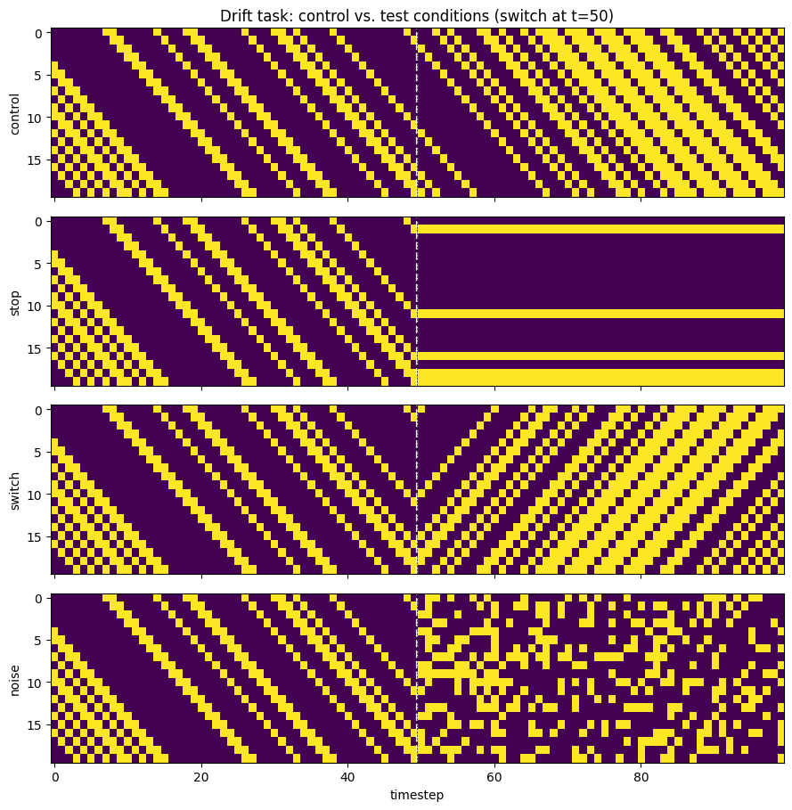
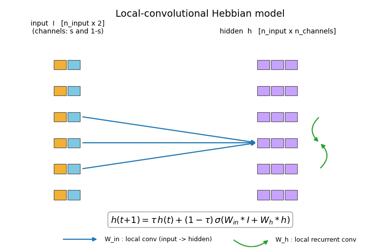
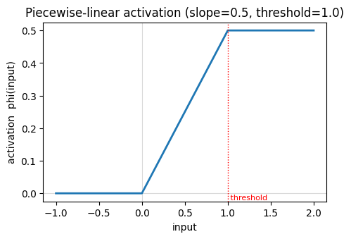
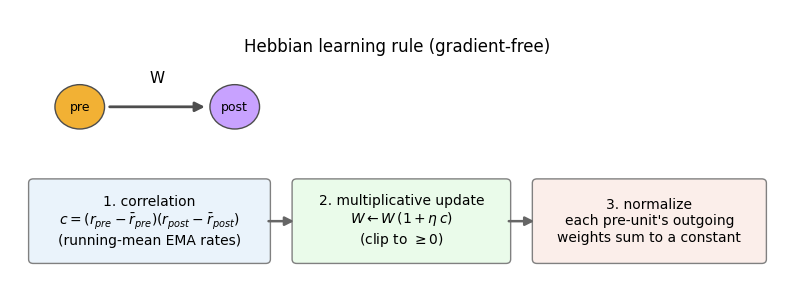
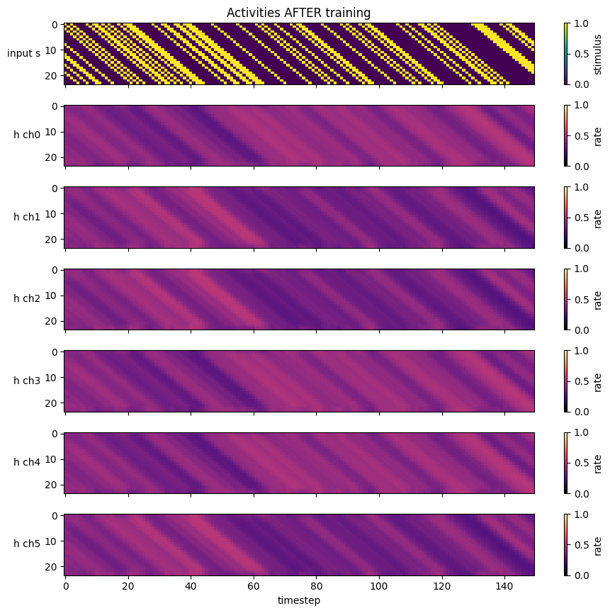
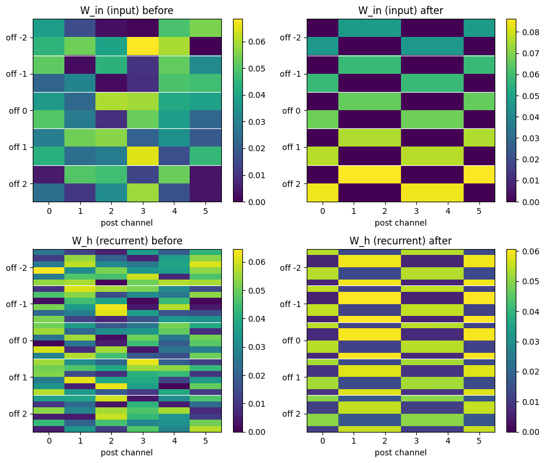
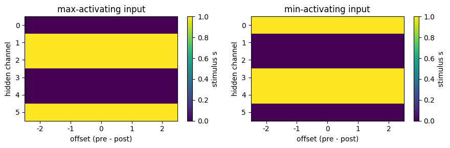
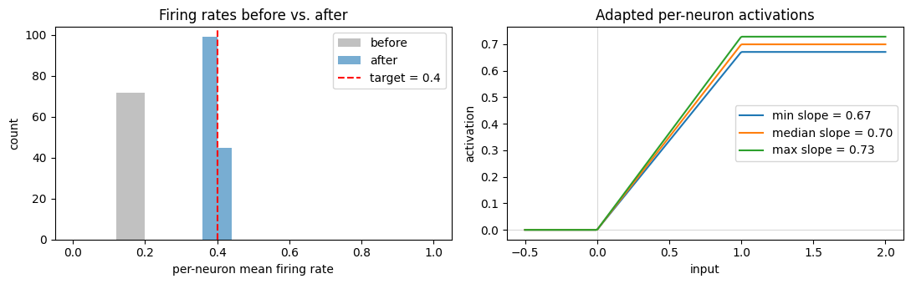

# toy_v2 — a gradient-free Hebbian local-convolutional model on a drifting stimulus

This directory explores **unsupervised, biologically-flavoured learning** with no
gradients and no PyTorch. A single time-varying stimulus (a drifting binary
vector) drives a two-layer neural model whose weights are shaped entirely by
**local correlational (Hebbian) plasticity**, weight **normalization**, a
**homeostatic** gain-control rule, and a soft **pull toward each neuron's mean
weight**. Everything is plain NumPy.

It is the third in a series (`toy_v0` → `toy_v1` → `toy_v2`); this version
deliberately strips the setup down to one task and swaps the trained RNN of the
earlier versions for a learning rule that uses only quantities a neuron could
plausibly have access to locally.

---

## Directory layout

```
tasks/
  base.py                 # abstract Task: maintains a vector, advanced one step at a time
  drift.py                # DriftTask (+ test conditions: stop / switch / noise)
  demo_tasks.ipynb        # visualizes the task and its test conditions
models/
  local_conv_model.py     # LocalConvHebbianModel (pure numpy)
  demo_local_conv_model.ipynb   # end-to-end demo: schematics, training, analysis
images/                   # figures used in this README (exported from the demos)
```

---

## The task

`DriftTask` produces a length-`N` binary vector that **drifts one step to the
right** each timestep: the rightmost element drops off, everything shifts right,
and a fresh `Bernoulli(prob)` sample enters on the left.

Partway through a trial (by default at the halfway point) an optional **test
condition** takes over — a way to probe what a trained model has learned about
the stimulus:

- **stop** — the stimulus freezes (drift halts, vector held static)
- **switch** — the drift direction reverses (rightward → leftward)
- **noise** — drift is replaced by fresh Bernoulli noise every step

Because the pre-switch dynamics are identical, all conditions share the same
first half under a given seed and only diverge after the switch:



---

## The model

`LocalConvHebbianModel` has two layers over `n_input` spatial positions.

- **Input layer** `[n_input, 2]` — two channels per position: the stimulus `s`
  and its complement `1 − s`.
- **Hidden layer** `[n_input, n_channels]` — driven by a **local convolution**
  from the input (`W_in`) and a **local convolutional recurrence** from the
  hidden layer to itself (`W_h`). Convolutions are circular, so the weights are
  translation-invariant kernels of width `kernel_size`.



### Dynamics

```
h(t+1) = tau · h(t) + (1 − tau) · phi(W_in * I(t) + W_h * h(t))
```

where `*` is the circular local convolution and `phi` is a **clipped-linear**
activation — zero for inputs ≤ 0, rising with a slope, and flat above an input
threshold:



Each trial's hidden state is **initialized to every unit's running-mean rate**
(zeros before any learning), rather than to zeros or a learned map of the input.

### Learning rule (no gradients)

Every step, each weight is updated from the **correlation** between its pre- and
post-synaptic units, then the weights are renormalized and softly regularized:



1. **Additive Hebbian.** `W += lr · corr`, where `corr` is the product of the
   pre- and post-synaptic rates after subtracting each unit's running-mean rate
   (an EMA) — i.e. an estimate of their covariance.
2. **Normalization.** Each pre-synaptic channel's outgoing weights are clipped
   non-negative and rescaled to sum to a hyperparameter (`norm_in` / `norm_h`).
3. **Pull toward the mean.** Every weight is moved a fraction `weight_decay` of
   the way toward its neuron's mean outgoing weight (known analytically from the
   normalization as `norm / (K·C_post)`): above-mean weights decay, below-mean
   weights grow. Applied to the normalized weights this is sum-preserving.

### Homeostasis (no silent neurons)

Because the weights are non-negative, the pre-activation is always ≥ 0, so a
neuron's rate is monotone in its activation slope. Each neuron therefore adapts
its **own** activation slope to drive its running-mean rate toward a target:

```
slope ← slope + slope_lr · (target_rate − mean_rate)
```

Quiet neurons raise their gain; over-active ones lower it. This keeps the
population near a target firing rate and prevents units from going silent.

---

## What it learns

Training runs the rule over many independent drift sequences. A few things to
look at after training (all reproduced by `models/demo_local_conv_model.ipynb`):

**Hidden activity.** Some channels develop clean drift-tracking responses:



**Weight matrices.** The input and recurrent kernels acquire structure — the
recurrent kernel picks up weight at spatial offset −1, the signature of the
rightward drift (activity at position `p` came from `p−1` a step earlier):



**Receptive fields.** For each hidden channel we can read off the local input
that maximally / minimally drives it:



**Homeostasis.** Before training the neurons are saturated; after training the
per-neuron slopes have adapted (right) and the firing-rate distribution has moved
toward the target with no silent units (left):



---

## Running it

Open the notebooks with Jupyter from inside `toy_v2/`:

```bash
jupyter notebook tasks/demo_tasks.ipynb           # the task + test conditions
jupyter notebook models/demo_local_conv_model.ipynb   # the full model demo
```

The model demo starts with a single **hyperparameters cell** — task size, kernel
size, `tau`, activation slope/threshold, target rate, learning rates,
normalization, and the pull-toward-mean strength — so every knob is in one place.

Minimal programmatic use:

```python
from tasks import DriftTask
from models import LocalConvHebbianModel

task  = DriftTask(vector_length=24, prob=0.3)
model = LocalConvHebbianModel(n_input=24, n_channels=6, kernel_size=5)

for epoch in range(60):                      # train (learning on)
    model.run(task.generate(200, seed=epoch), learn=True)

I_seq, h_seq = model.run(task.generate(150), learn=False)   # evaluate
```

---

## Ideas for future directions

- **Make the drift genuinely learnable end-to-end.** Add a readout that predicts
  the next stimulus from the hidden state and measure prediction quality across
  the test conditions (stop / switch / noise) — a direct probe of whether the
  recurrence has internalized the motion.
- **Strengthen emergent structure.** The additive rule is gentle and the learned
  recurrent kernel is only weakly directional. Explore anti-Hebbian terms,
  spike-timing-style asymmetric windows, or a stronger competition/normalization
  to sharpen direction selectivity without the winner-take-all collapse of a
  multiplicative rule.
- **Deeper / multi-area stacks.** Generalize to more hidden layers (as in
  `toy_v1`), each learning from the layer below with the same local rule, and ask
  what hierarchical features emerge.
- **Richer tasks.** Bring back the `toy_v1` task family (2-D drift, variable
  speed, multiple objects, occlusion) and additional test conditions to stress
  the learned representation.
- **Actions and exploration.** Reintroduce an agent that can shift/steer the
  stimulus (the `toy_v1` action interface) and study how a policy interacts with
  the unsupervised representation — the "exploration policies" theme of the
  parent project.
- **Analysis tooling.** Quantify direction selectivity, sparseness, and
  receptive-field structure over training; track the homeostatic set-point and
  weight-distribution dynamics; sweep hyperparameters systematically.
- **Stability theory.** Characterize the fixed points of the coupled
  weight / slope / mean-rate dynamics — when does the homeostat converge, and how
  do `slope_lr`, `target_rate`, and `weight_decay` trade off?
